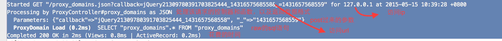

# 现象
rails 对于每一次请求，记录了下列信息:
* url，method，访问ip，访问时间，以及携带的参数
* 其给出了处理该请求的controller#function, 使得新人查bug时，能直接定位，不用查找代码去找到底是在哪儿被处理的。
* 对于涉及到sql语句的，会给出其生成的raw的sql语句，方便定位我们使用model方法是否正确, sql语句是否存在性能问题，如索引用的方法有误
* 给出了状态返回码，总耗费时间, view 和 activerecord分别花费了多少时间，方便性能调优



## 问题

rails是如何来实现它的呢？我们自己写的controller里并没有一行代码和它有关。

## 代码篇
1. 通过在rails源码目录中，grep Started * -r, 最终定位到[railties/lib/rails/rack/logger.rb](https://github.com/rails/rails/blob/master/railties/lib/rails/rack/logger.rb)  
```ruby
      # Started GET "/session/new" for 127.0.0.1 at 2012-09-26 14:51:42 -0700
      def started_request_message(request)
        'Started %s "%s" for %s at %s' % [
          request.request_method,
          request.filtered_path,
          request.ip,
          Time.now.to_default_s ]
      end
```
started_request_message这个函数，在每个request进来后，都会进行处理.

2. 通过在rails源码目录中，grep "Processing by" * -r, 最终定位到[actionpack/lib/action_controller/log_subscriber.rb](https://github.com/rails/rails/blob/master/actionpack/lib/action_controller/log_subscriber.rb)  
```ruby
    def start_processing(event)
      return unless logger.info?

      payload = event.payload
      params  = payload[:params].except(*INTERNAL_PARAMS)
      format  = payload[:format]
      format  = format.to_s.upcase if format.is_a?(Symbol)

      info ""Processing by" #{payload[:controller]}##{payload[:action]} as #{format}"
      info "  Parameters: #{params.inspect}" unless params.empty?
    end

    def process_action(event)
      info do
        payload   = event.payload
        additions = ActionController::Base.log_process_action(payload)

        status = payload[:status]
        if status.nil? && payload[:exception].present?
          exception_class_name = payload[:exception].first
          status = ActionDispatch::ExceptionWrapper.status_code_for_exception(exception_class_name)
        end
        message = "Completed #{status} #{Rack::Utils::HTTP_STATUS_CODES[status]} in #{event.duration.round}ms"
        message << " (#{additions.join(" | ")})" unless additions.blank?
        message
      end
    end
```
start_processing和process_action函数在收到相应event后都被触发，从而打印了这段日志:
```bash
Processing by ProxyController#proxy_domains as JSON
  Parameters: {"callback"=>"jQuery21309780391703825444_1431657568558", "_"=>"1431657568559"}
Completed 200 OK in 53ms (Views: 11.7ms | ActiveRecord: 1.5ms)
```
3. sql语句的输出，在哪呢？[activerecord/lib/active_record/log_subscriber.rb](https://github.com/rails/rails/blob/master/activerecord/lib/active_record/log_subscriber.rb)
```ruby

    def sql(event)
      return unless logger.debug?

      self.class.runtime += event.duration

      payload = event.payload

      return if IGNORE_PAYLOAD_NAMES.include?(payload[:name])

      name  = "#{payload[:name]} (#{event.duration.round(1)}ms)"
      sql   = payload[:sql]
      binds = nil

      unless (payload[:binds] || []).empty?
        binds = "  " + payload[:binds].map { |attr| render_bind(attr) }.inspect
      end

      if odd?
        name = color(name, CYAN, true)
        sql  = color(sql, nil, true)
      else
        name = color(name, MAGENTA, true)
      end

      debug "  #{name}  #{sql}#{binds}"
    end
```

4. [railties/lib/rails/rack/logger.rb](https://github.com/rails/rails/blob/master/railties/lib/rails/rack/logger.rb)和[actionpack/lib/action_controller/log_subscriber.rb](https://github.com/rails/rails/blob/master/actionpack/lib/action_controller/log_subscriber.rb), [activerecord/lib/active_record/log_subscriber.rb](https://github.com/rails/rails/blob/master/activerecord/lib/active_record/log_subscriber.rb)是怎样被使用到的？
最后的两个log_subscriber.rb都执行了attach_to函数，使得通过event分别和active_controller, active_record绑定了
```ruby
ActionController::LogSubscriber.attach_to :action_controller
```
```ruby
ActiveRecord::LogSubscriber.attach_to :active_record
```


## 相应参考资料
[lograge](https://github.com/roidrage/lograge), 方便的允许你去修改rails默认的logging输出, 如改成单行，方便grep，方便zabbix等收集信息  
[how-to-log-specific-request-details-to-rails-server-logs](http://stackoverflow.com/questions/11267540/how-to-log-specific-request-details-to-rails-server-logs), stackoverflow上，关于怎样输出更多信息，如useragent等的信息到日志中的问题  
[on-notifications-logsubscribers-and-bringing-sanity-to-rails-logging](http://www.paperplanes.de/2012/3/14/on-notifications-logsubscribers-and-bringing-sanity-to-rails-logging.html), 介绍了rails的logger机制  
[LogSubscriber](http://api.rubyonrails.org/classes/ActiveSupport/LogSubscriber.html)LogSubscriber的api文档